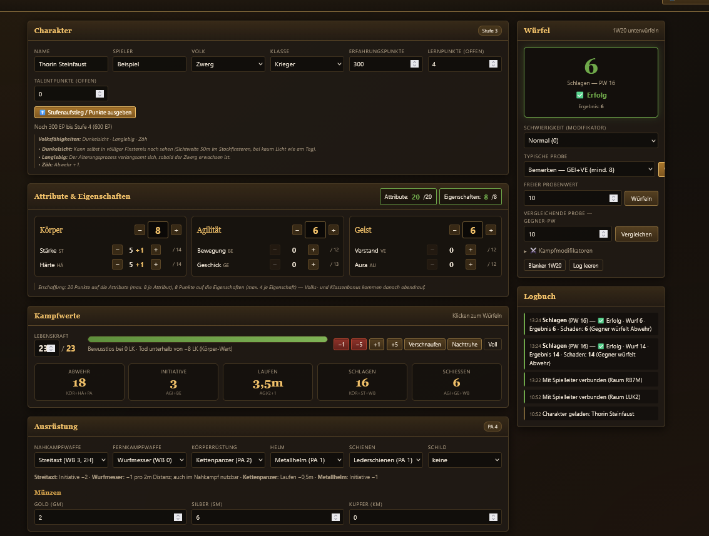
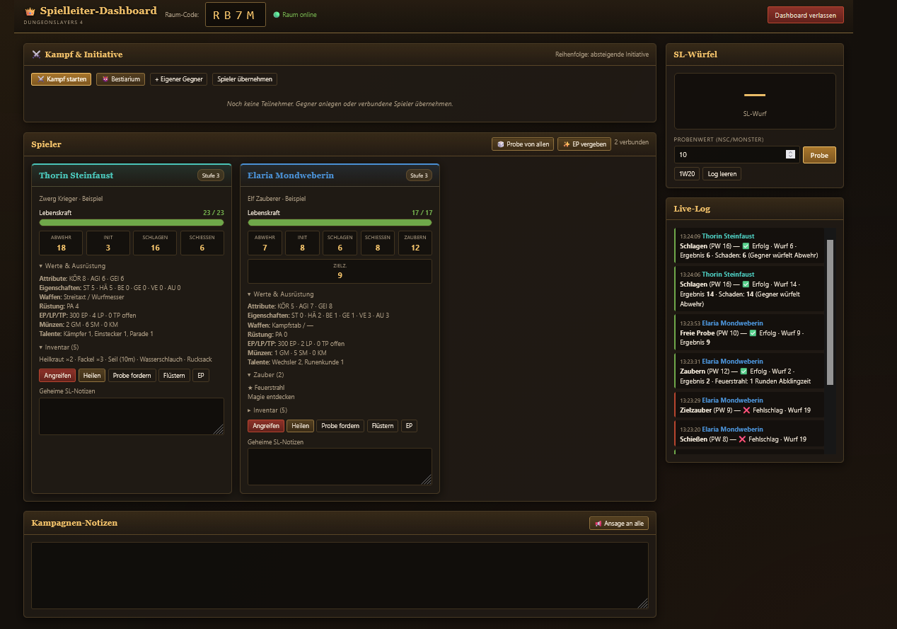
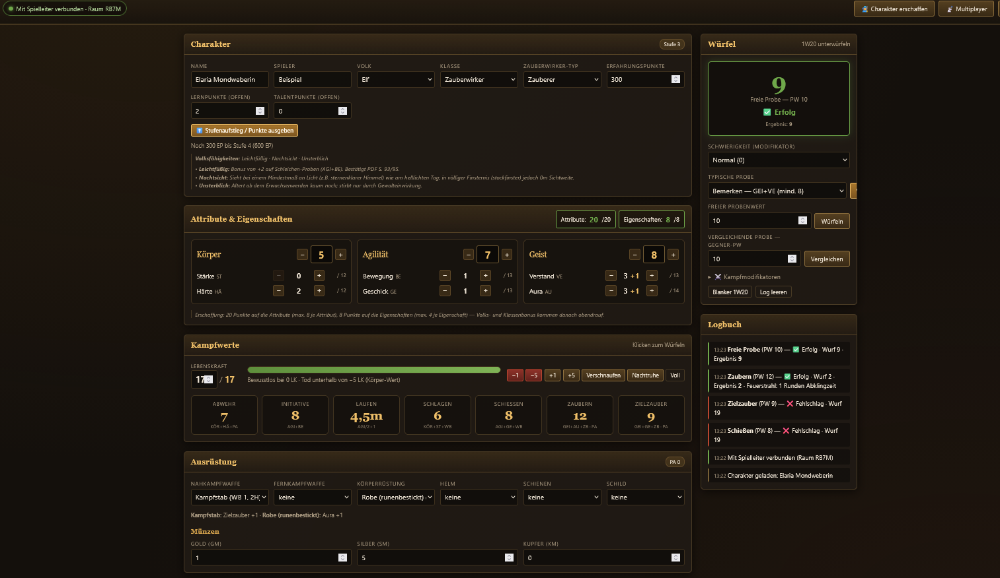

<div align="center">
  <h1>⚔️ Dungeonslayers 4 — Charakterbogen &amp; Spielleiter-Dashboard</h1>
  <p>
    <strong>Ein interaktiver, regelkonformer Charakterbogen mit Live-Multiplayer und Kampf-Tracker
    für das kostenlose Pen-&amp;-Paper-Rollenspiel <em>Dungeonslayers 4</em>.</strong><br>
    <em>Kein Server, keine Accounts, kein Build-Schritt.</em>
  </p>

  <p>
    <a href="https://dondavis-vibe.github.io/Dungeonslayers-pnp-tools/"><strong>🎲 Tool direkt öffnen</strong></a>
    &nbsp;·&nbsp;
    <a href="https://discord.gg/DPk8QRSZ5W"><strong>💬 Discord: Fragen &amp; Bug-Reports</strong></a>
  </p>

  <p>
    <a href="https://discord.gg/DPk8QRSZ5W"></a>
    <a href="LICENSE"></a>
    <a href="https://creativecommons.org/licenses/by-nc-sa/4.0/deed.de"></a>
    
  </p>
</div>

---

<div align="center">
  
  <p><em>Der Charakterbogen: alle Kampfwerte live berechnet, Proben per Klick, jeder Wurf im Logbuch.</em></p>
</div>

---

## Warum?

Dungeonslayers ist ein minimalistisches deutsches OSR-System, das komplett **kostenlos** als PDF
erhältlich ist ([dungeonslayers.net](https://www.dungeonslayers.net/downloads/)) — aber praktisch
keine digitalen Werkzeuge hat. Dieses Projekt schließt die Lücke.

## Schnellstart

**Einfach benutzen:** [dondavis-vibe.github.io/Dungeonslayers-pnp-tools](https://dondavis-vibe.github.io/Dungeonslayers-pnp-tools/)
öffnen — mehr braucht es nicht. Beim ersten Aufruf startet der Erschaffungs-Assistent; über
**👤 Beispiel** lädt man einen fertigen Charakter zum Ausprobieren.

Wer wissen will, was ein Kasten tut: Neben den Überschriften sitzt überall ein **„?"**, und
**❓ Hilfe** in der Kopfzeile öffnet die Kurzanleitung.

**Lokal weiterentwickeln:**

```bash
git clone https://github.com/DonDavis-vibe/Dungeonslayers-pnp-tools.git
cd Dungeonslayers-pnp-tools
python -m http.server 5178
```

Dann `http://localhost:5178` aufrufen. Kein npm, kein Build-Schritt, keine Abhängigkeiten —
reines HTML, CSS und JavaScript.

> Ein kleiner Webserver ist nötig, weil Browser beim direkten Öffnen per `file://` das Nachladen
> der Beispielcharaktere blockieren. Der Rest des Tools funktioniert auch so.

---

## Features

### 🧙 Charaktererschaffung (7 Schritte)
Führt exakt durch den Ablauf aus dem Regelwerk (S.3–7):

1. **Volk** — Elf, Mensch oder Zwerg, mit Volksfähigkeiten
2. **Klasse** — Krieger, Späher oder Zauberwirker (Heiler / Zauberer / Schwarzmagier)
3. **Attribute** — 20 Punkte auf Körper/Agilität/Geist, keines über 8
4. **Eigenschaften** — 8 Punkte auf die sechs Eigenschaften, keine über 4
5. **Volks- &amp; Klassenbonus** — je +1, erst hier darf über 4 gestiegen werden
6. **Ausrüstung** — Waffen und Rüstung mit Live-Warnungen bei Regelverstößen
7. **Feinschliff** — Name und Vorschau aller Kampfwerte

Die Punktebudgets werden hart erzwungen: Der „Weiter"-Knopf bleibt gesperrt, solange nicht exakt
verteilt ist, und die Plus-Knöpfe sperren an den Obergrenzen.

### 📋 Der Charakterbogen
- **Alle Kampfwerte live berechnet** — Lebenskraft, Abwehr, Initiative, Laufen, Schlagen, Schießen,
  Zaubern, Zielzauber. Ausrüstung fließt automatisch ein (Waffenbonus, Panzerung, Initiative-Malus
  schwerer Rüstung, Laufen-Abzüge, Aura-Bonus der Runenrobe).
- **Regelprüfungen** — warnt, wenn ein Zwerg zum Bihänder greift, ein Zauberer Kettenrüstung anlegt
  oder ein Schild neben einer Zweihandwaffe hängt.
- **Klassenfremde Rüstung wird nicht nur gemeldet, sondern gerechnet** (S.41): Der PA-Malus auf
  Zaubern und Zielzauber vervierfacht sich und die Agilität sinkt um den PA-Wert — das schlägt
  direkt auf Initiative, Laufen und Schießen durch. Das Talent *Gerüstet* hebt die erlaubte
  Rüstungsklasse je Rang an und nimmt den Malus wieder heraus.
- **Höchstwerte** — die Eigenschafts-Obergrenze (12, +1 je durch Volk/Klasse begünstigter
  Eigenschaft) wird pro Eigenschaft berechnet und angezeigt. Menschen wählen ihre beiden freien
  Höchstwert-Punkte („2 Eigenschaften +1 oder 1 Eigenschaft +2") im Stufenaufstiegs-Dialog.
- **Stufenaufstieg** — eigener Dialog mit den klassenabhängigen Lernpunkt-Kosten
  (günstige Eigenschaften 2 LP, übrige 3 LP, Lebenskraft 1 LP, Talentpunkt 3 LP). Der Knopf
  „+1 Stufe gutschreiben" hebt auch die Erfahrungspunkte auf die nächste Schwelle, damit Stufe,
  Talentzugang und Punktebudget zusammenpassen.
- **Steigerungen lassen sich zurücknehmen.** Jede Zeile im Aufstiegsdialog hat ein **−**, das den
  Wert senkt und die Lernpunkte erstattet — auch bei der Lebenskraft. Der Bogen merkt sich, was
  tatsächlich gekauft wurde, deshalb ist der Knopf gesperrt, wo nichts zu erstatten ist.
  Das Eigenschaften-Budget wächst dabei mit: Nach einer bezahlten Steigerung steht dort **9/9**
  in Grün, während ein unbezahlt hochgesetzter Wert weiterhin als Überschreitung erscheint.
- **Stufe herabsetzen wirkt symmetrisch.** Senkt man die Erfahrungspunkte, werden Lern- und
  Talentpunkte wieder abgezogen, statt sich aufzusummieren.
- **Charakter löschen** leert den Bogen vollständig (das Bild auf Nachfrage). Auch der
  Erschaffungs-Assistent startet von einem leeren Bogen, damit keine Talente oder Zauber des
  Vorgängers zurückbleiben.
- **Rasten** — *Verschnaufen* (halbe im Kampf verlorene LK zurück) und *Nachtruhe*
  (1W20/2 LK, +1 je 4 Stunden Bettruhe) als Ein-Klick-Aktionen. Läuft ein Kampf über den
  Rundenzähler mit, merkt sich der Bogen den Stand bei Kampfbeginn und verschnauft nur über die
  *in diesem Kampf* verlorene Lebenskraft — alte Wunden heilt es nicht mit.
- **Rüstzeiten** — wie viele Aktionen das Anlegen der getragenen Rüstung kostet (2 je Punkt
  Panzerung, Helme frei) und der Hinweis auf die KÖR+HÄ-Probe, wenn jemand in Metallrüstung schläft.
- **Verbesserungen und Verzauberungen** je Ausrüstungsplatz: ein Bonus auf Waffenbonus bzw.
  Panzerung plus freie Notiz für eingebettete Zauber oder freie Aktionen. Die Sonderregeln für
  magische Boni aus S.102 sind dabei umgesetzt: Ein **Waffenbonus** zählt auf Waffenbonus *und*
  Initiative und wird bei Treffern zusätzlich von der Abwehr des Gegners abgezogen. Ein
  **Rüstungsbonus** zählt auf die Panzerung, wirkt aber ausdrücklich **nicht** als Malus auf
  Zaubern und Zielzauber und mindert je Punkt den Initiative-Malus um 1 und den Laufen-Malus um
  0,5m. Für die Rüstzeit zählen magische Boni nicht mit (S.44).
- Inventar, Münzen und Notizen.

### ✨ Zaubersprüche (129 Stück, vollständig aus dem Regelwerk)
- **Paladine zaubern mit** — als einzige Heldenklasse einer nicht zaubernden Grundklasse wirken sie
  Heilersprüche mit um 9 Stufen verschobenem Zugang (S.16): Heilende Hand ab Stufe 10,
  Wiederbelebung ab 19. Zauber-Kampfwerte und Zauberliste erscheinen entsprechend.
- Die Auswahl zeigt **nur Zauber, die dein Zauberwirker-Typ auf deiner Stufe lernen darf** —
  Heiler, Zauberer und Schwarzmagier haben unterschiedliche Zugangsstufen für denselben Spruch.
- Jeder Eintrag bringt Zauberbonus, Dauer, Distanz, Abklingzeit, Preis und Wirkung mit.
- Der **Zauberbonus des vorbereiteten Zaubers fließt automatisch** in den Kampfwert ein, mit dem
  er auch gewirkt wird — ein Zielzauber-ZB landet nicht mehr versehentlich auch auf *Zaubern*.
  Unter beiden Karten steht, woher der ZB kommt oder warum dort keiner steht („kein Zauber
  vorbereitet", „wird über Zaubern gewirkt").
- Rund ein Fünftel der Sprüche hat einen **formelhaften Zauberbonus** (z.B. `−(KÖR+VE)/2 des
  Ziels`), der vom Ziel abhängt. Der Bogen rechnet dort mit 0 und markiert den Spruch mit
  *ZB formelhaft*, statt still einen falschen Wert einzusetzen.
- **Abklingzeiten** laufen am synchronisierten Rundenzähler mit; ein Patzer lässt den Zauber
  regelkonform „herausspringen".

### ⭐ Talente (125 Stück, vollständig aus dem Regelwerk)
Kein Freitextfeld, sondern eine echte Auswahl mit Regelprüfung:

- Die Liste zeigt **nur Talente, die deine Klasse auf deiner Stufe lernen darf**. Wer will, blendet
  die noch gesperrten mit ein — dort steht dann, ab welcher Stufe sie verfügbar werden.
- **Höchstränge werden erzwungen** — jedes Talent hat je Klasse einen eigenen Maximalrang (I–X).
  Heldenklassen heben ihn oft an, verlangen dafür aber eine höhere Stufe; der Bogen nimmt in dem
  Fall weiter den Zugang der Grundklasse und weist darauf hin, ab welcher Stufe mehr geht.
- **Mehrfach erwerbbare Talente je Gebiet** — *Handwerk*, *Wissensgebiet*, *Instrument* und
  *Waffenkenner* werden laut S.34/S.47 für jedes Gebiet einzeln gelernt und einzeln gesteigert.
  Ein Charakter kann also *Handwerk (Waffenschmied) III* und *Handwerk (Schreiner) I* nebeneinander
  führen; beim Lernen fragt der Bogen nach dem Gebiet.
- **Talentpunkte werden verrechnet**: 1 TP je Rang, beim Entfernen gibt es sie zurück, und ein
  Budget-Zähler warnt, wenn mehr Punkte verteilt sind als die Stufe hergibt.
- Wirkung und Steigerung pro Rang stehen direkt am Talent.
- **Dauerhafte Talentboni fließen automatisch in die Kampfwerte** — etwa *Kämpfer* (Schlagen +1
  je Rang), *Schütze* (Schießen und Zielzauber +1), *Einstecker* (LK +3), *Schnelle Reflexe*
  (Initiative +2), *Flink* (Laufen +1m) oder *Standhaft* (Bewusstlosigkeitsgrenze −3 LK).
  Die betroffene Karte weist den Bonus aus und nennt im Tooltip die Quelle.
- **Situative Talente** wie *Parade* oder *Blocker* werden bewusst **nicht** automatisch
  eingerechnet — sie stehen mit ihrer Bedingung als Erinnerung unter den Kampfwerten, und der
  Wert lässt sich mit einem Griff ins Feld *Bonus/Malus für den nächsten Wurf* anwenden.
- **Talente mit fester Auswahl** bekommen im Talentkasten ein Dropdown: *Vertrauter* (welchen
  Kampfwert der Vertraute +1 gibt — je Rang ein eigener), *Zauber auslösen* (welche Zauberklassen
  der Meisterdieb für Schriftrollen freischaltet). *Waffenkenner*, *Handwerk*, *Instrument* und
  *Wissensgebiet* werden weiterhin je Gebiet einzeln erlernt.
- **Zauberrelevante Talente** fließen ein: *Rüstzauberer* (ignoriert je Rang 2 Punkte
  Panzerungsmalus beim Zaubern), *Stabbindung* und *Zauberwaffe* (je Rang +1 auf Zielzauber,
  solange die gebundene Waffe geführt wird) sowie *Meister seiner Klasse* (Primärattribut der
  Grundklasse +1, wirkt damit auf alle abgeleiteten Werte). *Zauberroutine* (Heldenklasse
  Erzmagier) bindet je Talentrang einen Zauber, zu dem der Erzmagier **ohne Aktion und ohne
  GEI+VE-Probe** wechseln darf — wie mit einem Zauberstab. Es bleibt trotzdem bei einem aktiven
  Spruch: der Zauberbonus zählt immer nur für den gerade gewirkten Zauber (S.46), die gebundenen
  Sprüche stehen unter den Kampfwerten nur als Erinnerung, welche ohne Wechselprobe bereit sind.
- **Zauberartgebundene Talente** ebenfalls: Dafür sind die Zaubersprüche nach Art ausgezeichnet
  (Heil- und Schutzzauber, Feuer, Blitz, Elementarschaden, Untote — dazu das schon vorhandene
  Merkmal *geistesbeeinflussend*). *Fürsorger*, *Feuermagier*, *Blitzmacher*, *Herr der Elemente*,
  *Nekromantie* und *Manipulator* greifen damit automatisch, sobald der vorbereitete Spruch passt.
  *Magieresistent* bleibt ein Hinweis — ob ein Zauber gegen den Charakter gerichtet ist, weiß der
  Bogen nicht.
- **Heldenklassen** (ab Stufe 10, alle 15 mit ihren exklusiven Talentlisten) schalten zusätzliche
  Talente frei und heben teils den Höchstrang bereits bekannter Talente an. Einige ihrer Talente
  rechnen automatisch mit: *Waffenloser Meister* (WB und Gegnerabwehr beim Kampf ohne Waffe, dazu
  Abwehr/Initiative ohne Schild und ohne Rüstung über Stoff), *Verletzen*/*Scharfschütze*/
  *Verheerer* (Gegnerabwehr −1 je Rang auf Schlagen/Schießen/Zielzauber) und *Abklingen* (senkt
  die Abklingzeit jedes Zauberspruchs). *Zauber auslösen* (Meisterdieb) blendet Zaubern und
  Zielzauber ein, damit sich Schriftrollen auswürfeln lassen. Die meisten Heldenklassen-Talente
  sind eigene Mechaniken ohne Kampfwert-Bonus (Verwandlungen, Beschwörungen, Handwerk) und bleiben
  bewusst außen vor.
- **Volksfähigkeiten** mit exakter Spielwirkung (z.B. Zwergen-*Zäh*: Abwehr +1, wird automatisch
  in die Kampfwerte eingerechnet).

### 🎲 Die Probenmechanik
Vollständig nach Regelwerk S.38–40 umgesetzt:

- **1W20 unterwürfeln** gegen den Probenwert. Wurf ≤ PW = Erfolg.
- **Immersieg** bei natürlicher 1 — immer Erfolg, zählt als bestmögliches Ergebnis (voller PW).
- **Patzer** bei natürlicher 20 — immer Fehlschlag, im Kampf mit der jeweiligen Zusatzfolge
  (Waffe fällt, Zauber springt heraus, Charakter stürzt).
- **Probenwerte über 20** werden in Kettenwürfe zerlegt (20, dann Rest). Nur der erste Würfel kann
  patzen, erfolgreiche Teilergebnisse werden summiert. Wie in „Ergebnisse über 20 ermitteln"
  (S.40) fallen dabei **erst alle Würfel, dann wird zugeordnet** — der Bogen sucht automatisch die
  beste Verteilung, ein Immersieg zählt nur für seinen eigenen Teilwurf. Das Beispiel aus dem Buch
  (PW 44, Würfe 2/1/17) ergibt damit die dort genannten **39** Punkte.
- **Angriffe:** das Wurfergebnis *ist* der Schaden — wird direkt so ausgewiesen.
- Schwierigkeitsmodifikatoren von Routine (+8) bis Äußerst schwer (−8) — bleiben eingestellt,
  bis man sie zurücknimmt.
- **Bonus/Malus für den nächsten Wurf** — ein einmaliges Feld für alles Situative, das der Bogen
  nicht selbst kennt: aktives *Parade*, ein Vertrauter in Reichweite, ein Gegenstand mit
  begrenztem Effekt oder eine Ansage der Spielleitung. Zählt zusätzlich in den nächsten Wurf,
  steht im Log und stellt sich danach wieder auf 0. Macht die *situativen Talente* unter den
  Kampfwerten erstmals mit einem Klick anwendbar.
- **Vergleichende Proben** — beide Seiten würfeln, die höhere gelungene Probe gewinnt;
  misslingen beide, gibt es kein Ergebnis.
- **Kampfmodifikatoren** als aufklappbares Feld: Entfernung (−1 je 10m, bei Schleuder und
  Wurfmesser −1 je 2m), Zielen (+2 je Runde, max. +10), liegend, von hinten/der Seite,
  Größenunterschied und der Zwei-Waffen-Malus (automatisch um deine Ränge im Talent
  *Zwei Waffen* gemildert). Sie greifen **je nach Probenart unterschiedlich** (S.43–44):
  Distanz und Zielen nur bei Schießen/Zielzauber, Position und Größe des Ziels nur bei Angriffen,
  die Abwehr trifft ausschließlich „selbst am Boden liegend" und der Zwei-Waffen-Malus. Das Feld
  zeigt die drei Summen für Nahkampf, Fernkampf und Abwehr getrennt an. Für gewöhnliche
  Fertigkeitsproben gelten sie gar nicht.
- **Gegnerabwehr** der geführten Waffe (Breitschwert −2, Bihänder −4, waffenlos +5) fließt in die
  Abwehr des Ziels ein — beim Spieler automatisch, beim Spielleiter über die Schadenseingabe.
- **Kampfdetails aus S.43–44** sind abgedeckt: *Mehrere Gegner* (Schlagen auf bis zu vier
  angrenzende Gegner aufteilen, je ein eigener Angriff, −2 Abwehr pro Gegner) als eigener Dialog,
  dazu *Schüsse ins Getümmel* (+1 je Individuum, Schaden auf den Höchstschaden gedeckelt),
  *vorbei an Hindernissen* (−1 je Hindernis), *wehrlose Gegner* (doppelter Nahkampfschaden) und
  ein Hinweis aufs *Zurückdrängen* bei jedem gelungenen Nahkampftreffer.
- **Kampfpatzer nennen die geführte Ausrüstung**: Die Keule zerbricht, die Schlachtgeißel trifft
  den Angreifer selbst, der Holzschild zerspringt beim Abwehr-Patzer — statt eines allgemeinen
  Standardsatzes.
- **27 typische Proben** (Klettern, Schleichen, Schlösser öffnen …) mit automatisch passender
  Attribut+Eigenschaft-Formel, inklusive Sonderfällen wie dem Mindestwert 8 bei *Bemerken*
  und dem elfischen *Leichtfüßig*-Bonus auf Schleichen. Dazu gehören auch die drei Proben aus
  dem Magie-Kapitel: *Magie erspüren* (GEI+AU), *Magie identifizieren* (GEI+VE) und
  *Zauber wechseln* (GEI+VE) — letzteres mit dem Bonus aus dem Talent *Wechsler*.
- **Wissensproben mit Gebietsauswahl** — wer *Wissensgebiet* beherrscht, wählt vor dem Wurf sein
  Gebiet und bekommt die +3 je Rang angerechnet. Dazu ein eigener Knopf für **Handwerksproben**
  mit frei wählbarem Attribut und Eigenschaft, weil das Regelwerk dafür keine Formel festlegt.

### 📡 Live-Multiplayer (WebRTC, serverlos)
Der Spielleiter eröffnet einen Raum und erhält einen 4-stelligen Code; die Spieler treten damit bei.
Verbindung läuft direkt Peer-to-Peer über PeerJS — **keine Registrierung, keine Serverkosten**.

<div align="center">
  
  <p><em>Das Spielleiter-Dashboard: alle Helden live im Blick, jeder Wurf im Protokoll.</em></p>
</div>

**Der Spielleiter sieht live:** Lebenskraft-Balken aller Helden, Kampfwerte, Attribute,
Eigenschaften, Ausrüstung, Talente, bekannte Zauber (inkl. laufender Abklingzeiten), das
**Inventar** und EP/LP/TP — dazu ein Live-Log jedes Wurfs. Pro Charakter gibt es geheime
SL-Notizen (lokal gespeichert).

**Der Spielleiter kann senden:**
- **Angriff** → der Spieler würfelt automatisch seine Abwehr, der Restschaden wird angerechnet
  und zurückgemeldet (genau der Ablauf aus dem Regelwerk)
- **Heilung** und **Schaden ohne Abwehrmöglichkeit**
- **Probe fordern** — einzeln oder von der ganzen Gruppe; beim Spieler wird die passende Probe
  direkt vorgewählt
- **Erfahrungspunkte** einzeln oder an alle — nach Regelwerk S.88 als **EP-Summe der besiegten
  Gegner geteilt durch die Zahl der beteiligten Helden**. Der Dialog nennt Summe, Teiler und
  Ergebnis und schlägt zusätzlich das Viertel für ein erreichtes Abenteuerziel vor. Ein dadurch
  ausgelöster Stufenaufstieg schreibt Lern- und Talentpunkte automatisch gut — nach den
  **Hausregeln der Runde**, falls welche gesetzt sind
- **Flüstern** an einzelne Spieler und **Ansagen an alle**
- die **aktuelle Kampfrunde**, an der die Abklingzeiten der Zauber hängen

**Verbindungsanzeige:** Sobald ein Spieler Multiplayer nutzt, erscheint in der Kopfzeile eine
dauerhafte Statusanzeige — grün bei bestehender Verbindung (mit Raum-Code), pulsierend gelb beim
Verbinden, rot bei Abbruch. Ohne Multiplayer bleibt sie unsichtbar. Ein Klick öffnet das Menü mit
bereits vorausgefülltem Raum-Code.

Nachrichten der Gegenseite werden vor der Anzeige entschärft: Erlaubt bleibt nur die Formatierung,
die das Tool selbst verschickt (`<strong>`, `<em>`, `<br>`) — alles andere landet als Text im Log.
So kann ein fremder Teilnehmer im Raum kein beliebiges Markup in den Bogen der anderen schreiben.

Robustheit ist eingebaut: Reconnect mit Backoff, wenn der Signalling-Server die Verbindung kappt,
Wiederherstellung nach einem Reload, und eine Fehlerdiagnose, die bei gescheiterten Verbindungen
die ICE-Kandidaten auswertet und konkret sagt, woran es lag (blockiertes WebRTC, striktes NAT …).
Für harte NAT-Fälle lässt sich ein eigener TURN-Server hinterlegen.

### 🤖 Discord-Anbindung (optional)
> Fragen, Wünsche oder ein Bug? Auf dem **[Discord-Server](https://discord.gg/DPk8QRSZ5W)** werden
> diese Pen-&-Paper-Tools entwickelt und getestet — dort ist der richtige Ort dafür.

Damit die ganze Gruppe die Würfe mitliest und nicht nur der Spielleiter: Im Discord-Kanal unter
*Kanal bearbeiten → Integrationen → Webhooks* einen Webhook anlegen und die URL eintragen — über
**📡 Verbindung** im Dashboard oder **📡 Multiplayer** auf dem Spielerbogen, jederzeit auch bei
laufendem Raum. Danach landen Würfe (mit Probenwert, Wurf, Ergebnis und farbcodiert nach Immersieg /
Erfolg / Fehlschlag / Patzer) und Ereignisse (Schaden, Heilung, Bewusstlosigkeit, Stufenaufstieg,
Kampfbeginn, EP-Vergabe, Ansagen des Spielleiters) als Discord-Nachricht im Kanal — mit dem
Charakternamen bzw. *Spielleiter* als Absender. Auch die **Kampfwürfe des Spielleiters** (Angriffe
und Abwehr der Gegner) werden gepostet.

Würfe und Ereignisse lassen sich getrennt an- und abschalten, ein Testknopf prüft die Einrichtung.
Die Anfragen sind gedrosselt, damit Discord nichts verwirft, und ein Netzwerkausfall blockiert
das Tool nie.

> Die Webhook-URL ist ein Zugangsschlüssel für den Kanal. Sie liegt ausschließlich im
> `localStorage` dieses Browsers und wird bewusst **nicht** in die exportierte Charakterdatei
> geschrieben — geteilte Charaktere verraten den Webhook also nicht.

### 🗺️ Karte mit Raster, Figuren und Nebel des Krieges
Direkt in Bogen und Dashboard eingebettet, ein- und ausklappbar, dazu ein Vollbildmodus.
Nach Anhang B des Regelwerks gilt: **ein Feld = 1 Meter**.

- **Karte laden** — ein beliebiges Bild; es wird verkleinert und in Stücken an alle Spieler
  übertragen. Raster, Feldgröße, Versatz und **Rasterfarbe** (sechs Voreinstellungen) sind frei
  einstellbar; die −/+-Knöpfe der Zahlenfelder lassen sich gedrückt halten.
- **Figuren** kommen per Klick aus dem Kampf-Tracker oder werden einzeln gesetzt. Spieler
  erscheinen mit ihrem **Charakterbild**, umrandet in ihrer Farbe.
- **Figurengröße nach Größenkategorie.** Weil ein Feld einem Meter entspricht, lassen sich die
  Kategorien des Regelwerks direkt übersetzen: groß = 2 Felder, riesig = 3, gewaltig = 4. Über
  **📏 Größe** ist jede Figur anpassbar; Kreaturen aus dem Bestiarium bekommen ihre Größe
  automatisch. Ein Drache belegt damit ohne Zutun mehr Platz als ein Goblin.
- **Bewegung mit Bestätigung:** Zieht ein Spieler seine Figur, bleibt sie stehen und meldet den
  Zug als Vorschlag an — mit Entfernung in Feldern und Metern. Der Spielleiter sieht ihn neben
  dem *Laufen*-Wert des Helden, bekommt eine Warnung bei zu weiten Zügen und entscheidet.
  Der Spielleiter selbst versetzt Figuren jederzeit direkt.
- **Messen** per Werkzeug oder Umschalt+Ziehen, in Feldern und Metern.
- **Werkzeug-Kürzel** für den Spielleiter: `H` Hand, `R` Messen, `M` Malen, `E` Radieren,
  `F`/`G` Nebel auf/zu, `Esc` zurück zur Hand. Die **mittlere Maustaste schiebt die Karte** —
  auch mitten im Messen oder Zeichnen.
- **Markierungen** als Freihand, Linie, Kreis oder Rechteck in fünf Farben. Der Kreis beschriftet
  sich mit seinem Radius in Metern — praktisch für Zauberwirkungen.
- **↶ Rückgängig** (auch Strg+Z) nimmt die letzte Markierungs- oder Nebel-Aktion zurück, bis zu
  40 Schritte weit. Figuren-Positionen bleiben außen vor — die wandern auch über Spieler-Vorschläge
  und die Synchronisation.
- **Nebel des Krieges** mit rechteckigen oder runden Bereichen. Aufgedeckte Bereiche werden erst
  **vorgemerkt** (grün gestrichelt, für Spieler unsichtbar) und auf Knopfdruck freigegeben, damit
  man Fehlgriffe korrigieren kann. Der Spielleiter sieht den Nebel halbdurchsichtig, die Spieler
  deckend; Gegner in ungedecktem Nebel werden gar nicht erst übertragen.

### ⚙️ Hausregeln
Dungeonslayers lebt von Fanwerken und Hausregeln — deshalb sind die wichtigsten Stellschrauben
einstellbar, ohne die Regeldateien anzufassen:

- **Steigerungskosten**: nach Regelwerk (günstige Eigenschaften 2 LP, übrige 3), **einheitlich**
  (die häufigste Hausregel: jede Eigenschaft gleich teuer) oder je Posten frei einstellbar.
- **Talentpunkte je Stufe** frei wählbar, dazu optional ein **zweiter, getrennt geführter Topf**
  (z.B. für Talente außerhalb des Kampfes). Name und Anzahl bestimmt ihr; beim Lernen wählt man,
  aus welchem Topf bezahlt wird, und beim Entfernen fließt der Punkt dorthin zurück.
- **Die beiden optionalen Kampfregeln aus S.45** einzeln zuschaltbar:
  - **Slayende Würfel** — ein Immersieg bei Angriff oder Abwehr löst sofort einen weiteren Wurf aus
    (Patzer dabei ausgeschlossen); gelingt er, kommt sein Ergebnis dazu, ein erneuter Immersieg
    wiederholt das Ganze. Bei Probenwerten über 20 zählt nur ein Immersieg des ersten Würfels.
    Gilt auch für NSC im Kampf-Tracker. Das Buchbeispiel (Schlagen 14, Würfe 1/1/8) ergibt die
    dort genannten **36** Punkte.
  - **Slayerpunkte** — ein eigenes Feld unter den Kampfwerten. Der Bogen schreibt automatisch
    1 SP je Kampfrunde gut, in der du Schaden verursachst (höchstens 3), lässt sie am Kampfende
    und bei Bewusstlosigkeit verfallen und bietet die komplette Ausgabetabelle des Regelwerks
    zum Einsetzen an — gefiltert nach dem, was du dir gerade leisten kannst.
    Auch **Heiler, die im Kampf verletzte Kameraden heilen**, bekommen einen Punkt: automatisch
    bei einem gelungenen Heilzauber, sonst über den Knopf **★ Heilung** — ob der Kamerad in
    diesem Kampf verletzt wurde, weiß nur der Tisch.
  - Sind Slayende Würfel ohne Slayerpunkte aktiv, weist das Tool auf die Empfehlung des Regelwerks hin.
- **Eigene Talente, Zauber und Heldenklassen** anlegen — sie erscheinen in den Auswahllisten neben
  den offiziellen, sind als *Hausregel* gekennzeichnet und unterliegen derselben Zugangsprüfung.

Der **Spielleiter stellt die Regeln ein und schickt sie an die Runde**; wer später beitritt,
bekommt sie automatisch. Zusätzlich lassen sie sich als Datei speichern und weitergeben.

### ❓ Eingebaute Hilfe
Neben jeder Überschrift und an den erklärungsbedürftigen Bedienelementen sitzt ein kleines
**„?"**. Ein Klick öffnet ein Popover mit der Erklärung dazu — was der Kasten tut, welche Regel
dahintersteckt und worauf man achten muss. Ein zweiter Klick, ein Klick daneben oder `Esc`
schließt es wieder.

Der Knopf **❓ Hilfe** in der Kopfzeile (im Dashboard ebenso) fasst dieselben Texte zu einer
**Kurzanleitung** zusammen, gegliedert in Erste Schritte, Charakterbogen, Würfeln, Zusammen
spielen und Spielleiter-Dashboard. Aus jedem Popover führt *📖 Ganze Anleitung* direkt zum
passenden Abschnitt.

36 Themen sind es derzeit, verteilt auf die fünf Gruppen. Besonderes Augenmerk lag auf den
Stellen, die sich von selbst nicht erklären:

- **Die Karten-Werkzeugleiste des Spielleiters** — rund 20 Bedienelemente in einer Zeile. Bisher
  erklärten die nur `title`-Tooltips, die beim Hovern erscheinen und auf dem Tablet **gar nicht**.
  Die Hilfe geht die Leiste in vier Blöcken durch: Karte & Figuren, Werkzeuge, Nebel, Raster.
  Vor allem der Nebel ist zweistufig — 🔦 Auf *merkt nur vor*, erst „Für Spieler freigeben"
  deckt wirklich auf.
- **Slayerpunkte** — wann es automatisch einen Punkt gibt (1 SP je Kampfrunde, in der du Schaden
  verursachst, nie zwei in derselben Runde) und wofür der Knopf ★ Heilung da ist: Ob der geheilte
  Kamerad *in diesem Kampf* verletzt wurde, kann das Tool nicht wissen — das weiß nur der Tisch.
- **Kampfmodifikatoren** — dass sie je nach Probenart unterschiedlich greifen und für gewöhnliche
  Fertigkeitsproben gar nicht.
- **Klassenfremde Rüstung**, **Kettenwürfe über 20** und die **EP-Vergabe nach S.88** — überall
  dort, wo das Tool mehr rechnet, als man ihm ansieht.

Die Texte stehen gesammelt in [`hilfe.js`](hilfe.js) — ein Eintrag im Verzeichnis, und das „?"
im HTML verweist über `data-hilfe="…"` darauf. Neue Hilfen brauchen also keine Verdrahtung:

```html
<h3>Talente</h3><button class="help-btn" data-hilfe="talente">?</button>
```

Die Klicks laufen über Delegation am `document`, deshalb funktionieren „?" auch in Markup, das
erst zur Laufzeit entsteht — etwa in der Werkzeugleiste der Karte oder im Slayerpunkte-Kasten.
Ein neues Thema gehört in `HILFE_THEMEN` und erscheint damit automatisch an beiden Orten: im
Popover und in der Kurzanleitung.

### 💾 Sitzung speichern und laden (Spielleiter)
Notizen, Gegner samt Lebenskraft und Position, Figurenplätze auf der Karte, Nebel, Markierungen
und der Rundenzähler wandern in eine JSON-Datei — wahlweise mit oder ohne Kartenbild. Zusätzlich
sichert das Tool laufend automatisch: Nach einem versehentlichen Neuladen bietet es an, die
frühere Sitzung wiederherzustellen.

### ⚔️ Kampf-Tracker (Spielleiter)
- **Initiative-Reihenfolge** absteigend sortiert, mit einmaligem W20-„Stechen" bei Gleichstand
- **Rundenzähler**, der automatisch an alle Spieler synchronisiert wird
- **Abwartehandlung** per Klick: +2 Initiative je Runde ohne Aktion (höchstens +10), die
  Reihenfolge sortiert sich live um; sobald der Charakter handelt, verfällt der Bonus
- **Bestiarium mit 78 Kreaturen** aus dem Regelwerk — durchsuchbar, nach Gegnerhärte sortiert,
  per Klick direkt in die Initiative-Reihenfolge. Der Knopf **„+ Karte"** setzt die Kreatur in
  einem Zug in den Kampf *und* als Figur auf die Karte, in der Größe ihrer Kategorie.
  Mehrfach eingesetzte Gegner werden automatisch durchnummeriert. Eigene Gegner lassen sich
  daneben frei anlegen.
- **NSC-Angriffe** per Klick: gegen Spieler würfelt der Spieler selbst die Abwehr, gegen andere
  NSC wird sie direkt mit ausgewürfelt
- **Gegnerabwehr der Monsterwaffen** wird aus dem Statblock gelesen (z.B. „Massive Keule
  (WB+2; GA−2)") und beim Angriff mitgeschickt; in der Zeile ist sie nachträglich änderbar
- **Heroische und epische Gegner** (S.105) per Auswahl: Lebenskraft ×5 bzw. ×10, Abwehr +2/+4,
  ein Angriffswert +2/+4 und die neu berechneten EP. Aus dem Ork (LK 23, 63 EP) wird so ein
  heroischer Brocken mit LK 115 und 318 EP — jederzeit wieder zurücknehmbar, ein angeschlagener
  Gegner behält dabei seinen Verletzungsgrad
- **Größenkategorien** stehen an jedem Gegner und fließen automatisch in den Angriff ein:
  Ein Oger, der auf einen Goblin einschlägt, bekommt seine −4 für zwei Kategorien Unterschied
  ohne Zutun des Spielleiters
- Werte, die ein Statblock gar nicht nennt oder als Ausdruck führt (Schwarmwert, „5+1"), setzt der
  Tracker als Platzhalter ein und **sagt ausdrücklich dazu**, dass sie nachgetragen gehören
- Verbundene Spieler werden mit Live-Werten in die Reihenfolge übernommen
- **NSC lassen sich einem Spieler zuordnen** („Gehört") — praktisch für Beschwörungen und
  Vertraute. Rein informativ (Namensschild in Spielerfarbe an der Kampf-Zeile), keine
  automatische Regelwirkung; die Zuordnung übersteht Sitzung speichern/laden mit

---

## Beispielcharaktere

Im Ordner [`beispiele/`](beispiele/) liegen zwei fertige Helden zum Ausprobieren (über
„📂 Laden" einlesen):

| Charakter | Volk / Klasse | Profil |
|---|---|---|
| **Thorin Steinfaust** | Zwerg Krieger | Nahkampf-Brocken: LK 26, Abwehr 18, Schlagen 17 — dafür träge (Initiative 3) |
| **Elaria Mondweberin** | Elfin Zauberin | Zerbrechlich (LK 17, Abwehr 7), aber Zaubern 12 dank runenbestickter Robe |

<div align="center">
  
  <p><em>Zauberwirker bekommen zusätzlich Zaubern und Zielzauber; oben links zeigt die Anzeige die bestehende Verbindung zum Spielleiter.</em></p>
</div>

---

## Projektstruktur

| Datei | Inhalt |
|---|---|
| `index.html` | Aufbau von Spieleransicht, SL-Dashboard und Dialogen |
| `style.css` | Gesamtes Design |
| `data.js` | Regeldaten: Völker, Klassen, Waffen, Rüstungen, EP-Tabelle, typische Proben |
| `talents.js` | 125 Talente, 15 Heldenklassen, Volksfähigkeiten — aus dem Regelwerk extrahiert |
| `zauber.js` | 129 Zaubersprüche mit Zugangsstufen je Zauberwirker-Typ |
| `bestiarium.js` | 78 Kreaturen mit vollständigen Statblocks |
| `rules.js` | Regel-Engine: Kampfwert-Berechnung und Probenauflösung |
| `app.js` | Charakterbogen: Zustand, Darstellung, Würfeln, Stufenaufstieg |
| `talentPicker.js` | Talent-Auswahl mit Zugangs- und Rangprüfung |
| `spellPicker.js` | Zauber-Auswahl mit Zugangsprüfung |
| `wizard.js` | Charaktererschaffung |
| `combat.js` | Kampf- und Initiative-Tracker samt Bestiarium |
| `battlemap.js` | **Eigenständiges Karten-Modul** — kennt kein Regelsystem, frei wiederverwendbar |
| `mapui.js` | Anbindung der Karte an Bogen, Dashboard und Verbindung |
| `hausregeln.js` | Einstellbare Hausregeln und eigene Talente, Zauber und Heldenklassen |
| `session.js` | Sitzung des Spielleiters sichern, laden und nach einem Reload retten |
| `multiplayer.js` | WebRTC-Verbindung und SL-Dashboard |
| `discord.js` | Optionale Discord-Webhook-Anbindung |
| `hilfe.js` | Hilfetexte hinter den „?"-Symbolen und die Kurzanleitung |
| `header.svg` | Kopfbild der Seite — von Hand gezeichnetes SVG in der Farbpalette des Bogens |
| `regeln/` | Die offiziellen PDFs plus aufbereitete Regel-Referenzen |
| `beispiele/` | Fertige Charaktere als JSON |

Charaktere werden automatisch im `localStorage` gesichert und lassen sich als `.json`
exportieren und wieder einlesen.

---

## Regelwerk

Das Grundregelwerk (172 Seiten) und der Schnelleinstieg *First Slay* stehen kostenlos auf
[dungeonslayers.net](https://www.dungeonslayers.net/downloads/) zum Download bereit.

Aufbereitete Referenzen für die Entwicklung liegen unter [`regeln/`](regeln/) als Markdown — die
Mechanik-Zusammenfassung nennt zu jedem Abschnitt die Seitenzahl im PDF.

> **Hinweis für eine Veröffentlichung:** Die PDFs selbst gehören *nicht* in ein öffentliches
> Repository. Zwar stehen Texte und Regelmechaniken unter CC BY-NC-SA, die enthaltenen
> Illustrationen, das Covermotiv und die Logos aber ausdrücklich **nicht** — eine Weitergabe der
> kompletten PDF-Datei würde diese mitverbreiten. Stattdessen auf die offizielle Downloadseite
> verlinken. Siehe [`.gitignore`](.gitignore).

## Mitmachen

Mitstreiter sind sehr willkommen — das Projekt ist bewusst niedrigschwellig gehalten: reines HTML,
CSS und JavaScript, kein Framework, kein Build-Schritt. Repository klonen, Datei öffnen, loslegen.

Besonders hilfreich wäre:

- **Regelkorrekturen.** Das Tool ist aus dem PDF heraus entstanden, nicht aus Spielpraxis. Wenn eine
  Mechanik falsch umgesetzt ist, ist das die wertvollste Rückmeldung überhaupt — gerne als Issue.
- **Berichte aus dem Spiel.** Was fehlt am Tisch, was nervt, was wird nie benutzt?
- **Fehlermeldungen**, gerne mit Browser und Schritten zum Nachstellen.

Wer keinen Code beisteuern möchte: Issues und Rückmeldungen sind genauso viel wert.

**Anlaufstelle:** GitHub-Issues oder der **[Discord-Server](https://discord.gg/DPk8QRSZ5W)** — dort
werden diese Pen-&-Paper-Tools entwickelt und getestet, und dort landen Bug-Reports am schnellsten.

### Wo was steckt

Die Regeldaten (`talents.js`, `zauber.js`, `bestiarium.js`, `data.js`) sind reine Datendateien ohne
Logik — dort lassen sich Werte korrigieren, ohne den Rest anzufassen. Die eigentliche Regelmechanik
steckt kompakt in `rules.js`, alles Sichtbare in `app.js` und den Picker-Dateien.

**Das Karten-Modul ist bewusst systemunabhängig.** `battlemap.js` kennt weder Dungeonslayers noch
die Netzwerkverbindung — es zeichnet Karte, Raster, Figuren, Markierungen und Nebel, verwaltet Zoom
und Verschiebung und meldet jede Änderung über einen Rückruf. Für ein anderes Projekt reichen ein
paar Zeilen:

```js
const map = BattleMap.create(canvasElement, {
    onChange: zustand => verbindung.send(zustand),
    einheit: 1.5, einheitName: 'm'          // z.B. 1 Feld = 1,5 Meter
});
map.setBild(dataUrl);
map.addFigur({ id: 'p1', name: 'Thorin', farbe: '#d4a24c', x: 3, y: 4 });
map.applyState(vomNetzwerkEmpfangenerZustand);
```

Koordinaten sind immer Rasterfelder, nie Pixel — dadurch bleibt der Zustand unabhängig von
Bildschirmgröße und Zoomstufe und ist klein genug, um ihn bei jeder Bewegung zu übertragen.

### Nach einer Änderung: Versionsnummer hochzählen

Alle eigenen Dateien werden mit einem Versionsparameter eingebunden (`app.js?v=20260825i`). Wer
etwas ändert, zählt die Version in `index.html` hoch — sonst behalten Besucher die alte Fassung
aus dem Browser-Cache.

## Lizenz

**Programmcode** (`app.js`, `rules.js`, `wizard.js`, `combat.js`, `multiplayer.js`, `discord.js`,
`talentPicker.js`, `spellPicker.js`, `index.html`, `style.css`): MIT-Lizenz.

**Regeldaten** (`data.js`, `talents.js`, `zauber.js`, `bestiarium.js` sowie die Referenzen in
`regeln/`): abgeleitet aus dem Dungeonslayers-Regelwerk und daher unter
**[CC BY-NC-SA 4.0](https://creativecommons.org/licenses/by-nc-sa/4.0/deed.de)** — dieselbe Lizenz,
unter der Christian Kennig Texte und Regelmechaniken freigegeben hat. Wirkungstexte sind
zusammengefasst, nicht wörtlich übernommen.

*Dungeonslayers* wurde von **Christian Kennig** geschaffen (Copyright © 2011, Burning Books, Berlin).
Dieses Tool ist ein nicht-kommerzielles Fan-Projekt und steht in keiner Verbindung zum Autor
oder zum Verlag.
